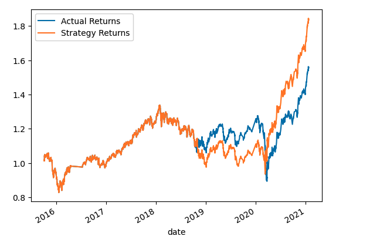
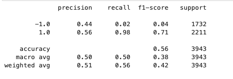
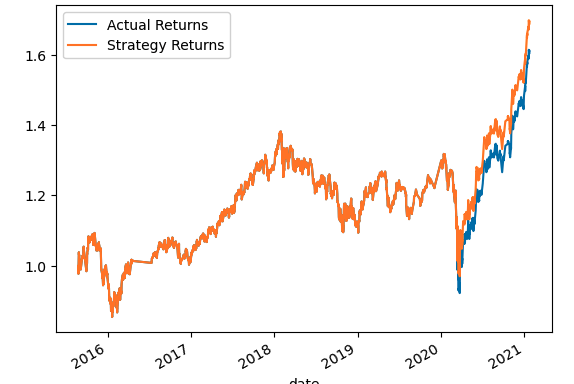
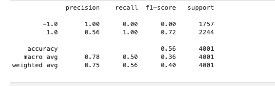
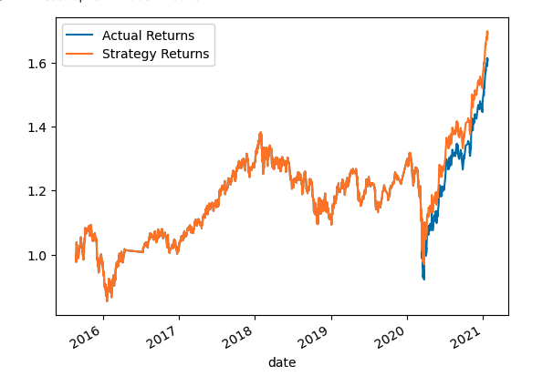
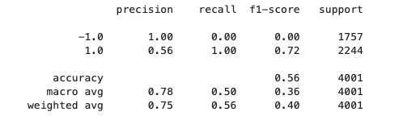

# Machine Learningn Tradning Bot
These are a Juypter Lab notebooks that look at historial data and creates and algorithm that can buy and sell faster than humans. We give the algo peramiters and create trading signals using moving averages. There are a combination of different windows for moving averages and there are different combinations of training time for the algorithms. In some oft the alt notebooks there are test to see what would work best, its a method of tuning. Lastly we evaluate a new learning classifier with a LogisticRegression from sklearn. 

## Technologies

This project leverages python 3.7 with the following packages:

* [pandas](https://github.com/pandas-dev/pandas) - An Open Source Machine Learning Framework for Everyone

* [numbpy](https://github.com/numpy/numpy) - The fundamental package for scientific computing with Python

* [metaplot](https://github.com/matplotlib/matplotlib) - For entrypoint and help page.

* [imblean.metrics](http://glemaitre.github.io/imbalanced-learn/generated/imblearn.metrics.classification_report_imbalanced.html) - Build a classification report based on metrics used with imbalanced dataset

* [sklean.metrics](https://github.com/scikit-learn/scikit-learn) - Simple and efficient tools for predictive data analysis  
    OncHotEncoder, StandardScaler, train_test_split

## Installation Guide

Before running the application first install the following dependencies. Note that if you are running on the cloud and not locally you will have to run all lines of code.

``` import pandas as pd
import numpy as np
from pathlib import Path
import hvplot.pandas
import matplotlib.pyplot as plt
from sklearn import svm
from sklearn.preprocessing import StandardScaler
from pandas.tseries.offsets import DateOffset
from sklearn.metrics import classification_report
```

---
## Usage

Acitvate a Jupyter Lab Notebook by having the kernal installed and typing `jupyter lab` in your terminal.  

---

## Examples
```
# Initialize the new Signal column
signals_df['Signal'] = 0.0
# When Actual Returns are greater than or equal to 0, generate signal to buy stock long
signals_df.loc[(signals_df['Actual Returns'] >= 0), 'Signal'] = 1
# When Actual Returns are less than 0, generate signal to sell stock short
signals_df.loc[(signals_df['Actual Returns'] < 0), 'Signal'] = -1
# Review the DataFrame
display(signals_df.head())
display(signals_df.tail())

```

---

## Alternate Models 

### This is the alterate model created by adjusting the training window to six month, three months longer training. 





As you can see. The model didnt improve by much, more of the answer is in the main motebook as well. 

### This is the alternate model created by adjusting the SMA windows to 5 and 50 days. 





The accuracy went up and the plot reflect a more accurate prediction for returns. 

### This is the final alternate by using 6 months of data to train and the SMA windows to 5 and 50. 





As you can tell the test is identical to moving the SMA and the training data did not effect the results what so ever. There is more of a reason int the notebook. 


## Contributors

DU Starter Code
Terrence McCoy


---

## License

MIT